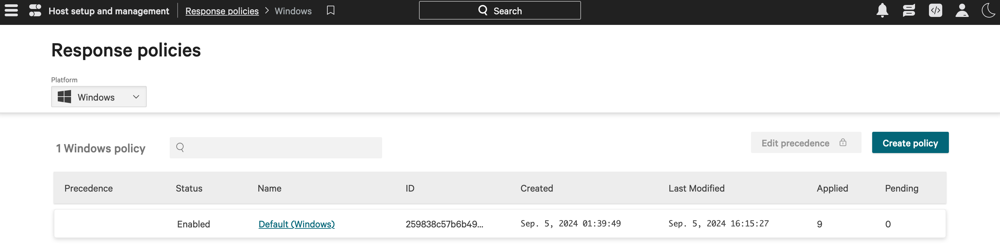

# Executors

## Introduction

To be able to use the power of the OpenBAS platform on endpoints, you need at least one **neutral executor** that will
be in charge of executing implants as detached processes. Implants will then execute payloads.


The OpenBAS platform manages 4 executors which can be installed on Windows, Linux and MacOS using x86_64 or arm64
architectures. This table below summarizes the information about each agent.

| Executor                           | Type          | Installation mode                                 | Installation type | Run As                                 | Payload execution                              | Multi agents for an endpoint                     |
|:-----------------------------------|:--------------|:--------------------------------------------------|:------------------|:---------------------------------------|:-----------------------------------------------|:-------------------------------------------------|
| **OpenBAS Agent (native/default)** | Open source   | As a user session, user service or system service | Script            | A standard or admin background process | As a user standard, user admin or system admin | Yes, depending on the user and installation mode |
| **Tanium Agent**                   | Under license | As a system service                               | Executable        | An admin background process            | As a system admin                              | No, always the same agent                        |                              
| **Crowdstrike Falcon Agent**       | Under license | As a system service                               | Executable        | An admin background process            | As a system admin                              | No, always the same agent                        |                              
| **Caldera Agent**                  | Open source   | As a user session                                 | Script            | An admin background process            | As a user admin                                | Yes, depending on the user                       |                      

For more details about the installation and working of each agent, see the sections dedicated below.

## OpenBAS Agent

The OpenBAS agent is available for Windows, Linux and MacOS, it is the native / default way to execute implants and
payloads on endpoints.

[Learn More](../../usage/openbas-agent.md)

## Tanium Agent

The Tanium agent can be leveraged to execute implants as detached processes that will then execute payloads, according
to the [OpenBAS architecture](https://docs.openbas.io/latest/deployment/overview).

### Configure the Tanium Platform

We
provide [two Tanium packages](https://github.com/OpenBAS-Platform/openbas/blob/master/openbas-api/src/main/java/io/openbas/executors/tanium/openbas-tanium-packages.json)
to be imported into the Tanium platform.


!!! warning "Tanium package configuration"

    Because OpenBAS should run implants as detached processes, you must uncheck  
    **"Launch this package command in a process group"** in the package configuration:

    

!!! warning "Tanium Threat Response usage"

    If your environment uses **Tanium Threat Response (TTR)** together with the Tanium agent, you should rely on the **dedicated TTR package**.  
    This package technically works in all cases, but it is **only recommended** when OpenBAS runs on endpoints with TTR enabled.  
    Reason: this package performs more extensive operations on the machine and can generate **more noise and alerts**.  
    → If you do **not** use Tanium Threat Response, prefer the **standard Tanium package**.  

    📦 Packages to import:  
    - [OpenBAS Tanium Windows & Unix package (TTR)](https://github.com/OpenBAS-Platform/openbas/blob/master/openbas-api/src/main/java/io/openbas/executors/tanium/openbas-tanium-packages-TTR.json)  

    📜 Scripts to attach in the package configuration into files section:   
    - [Windows TTR script](https://github.com/OpenBAS-Platform/openbas/blob/master/openbas-api/src/main/java/io/openbas/executors/tanium/openbas-ttr.ps1)  
    - [Unix TTR script](https://github.com/OpenBAS-Platform/openbas/blob/master/openbas-api/src/main/java/io/openbas/executors/tanium/openbas-ttr.sh)

| Package type                | Recommended use case                  | Characteristics                                            |
|-----------------------------|---------------------------------------|------------------------------------------------------------|
| **Standard Tanium package** | Default use with Tanium agent only    | Lightweight, minimal impact, recommended in most scenarios |
| **TTR package**             | Tanium agent + Tanium Threat Response | Enables additional operations, may generate more noise     |

Once configured and imported, retrieve the package IDs from the URL:  
`ui/console/packages/XXXXX/preview`.

> ℹ️ Common group IDs in Tanium:
>
> - **Computer Group ID**: identifies which endpoints will be queried.
> - **Action Group ID**: identifies where actions (like package execution) are allowed.

If you use the TTR mechanism, you will also need to attach two scripts (Windows & Unix) to the corresponding packages in
the Tanium UI.  
*(screenshot placeholder here where scripts should be added)*

---

### Configure the OpenBAS Platform

To use the Tanium executor, fill the following configuration:

| Parameter                          | Environment variable               | Default value | Description                                     |
|:-----------------------------------|:-----------------------------------|:--------------|:------------------------------------------------|
| executor.tanium.enable             | EXECUTOR_TANIUM_ENABLE             | `false`       | Enable the Tanium executor                      |
| executor.tanium.url                | EXECUTOR_TANIUM_URL                |               | Tanium API URL                                  |
| executor.tanium.api-key            | EXECUTOR_TANIUM_API-KEY            |               | Tanium API key                                  |
| executor.tanium.computer-group-id  | EXECUTOR_TANIUM_COMPUTER_GROUP_ID  | `1`           | Tanium Computer Group to be used in simulations |
| executor.tanium.action-group-id    | EXECUTOR_TANIUM_ACTION_GROUP_ID    | `4`           | Tanium Action Group to apply actions to         |
| executor.tanium.windows-package-id | EXECUTOR_TANIUM_WINDOWS_PACKAGE_ID |               | ID of the OpenBAS Tanium Windows package        |
| executor.tanium.unix-package-id    | EXECUTOR_TANIUM_UNIX_PACKAGE_ID    |               | ID of the OpenBAS Tanium Unix package           |

!!! note "Tanium API Key"

    The Tanium API key must have permissions to:  
    - Retrieve the endpoint list from the Tanium GraphQL API  
    - Launch packages on endpoints  

---

### Checks

Once enabled, you should see **Tanium** available in the `Install agents` section:


Endpoints from the selected computer groups should now appear in the **OpenBAS Endpoints** section:


!!! note "Agent uniqueness"

    An endpoint can only have **one Tanium agent** registered due to MAC address uniqueness.  
    Installing a new agent will overwrite the existing one, and you will always see a single endpoint in the OpenBAS console.

!!! success "Installation done"

    You are now ready to leverage your Tanium platform to run OpenBAS payloads!

---

## CrowdStrike Falcon Agent

The CrowdStrike Falcon agent can be leveraged to execute implants as detached processes that will then execute payloads
according to the [OpenBAS architecture](https://docs.openbas.io/latest/deployment/overview).

The implants will be downloaded to these folders on the different assets:

* On Windows assets: `C:\Windows\Temp\.openbas\implant-XXXXX`
* On Linux or MacOS assets: `/tmp/.openbas/implant-XXXXX`

where XXXXX will be a completely random UUID, generated for each inject that will be executed.
This ensures that the implants are unique and will be deleted on assets' restart.

### Configure the CrowdStrike Platform

#### Upload OpenBAS scripts

First of all, you need to create two custom scripts, one for Windows and one for Unix, covering both Linux and MacOS
systems.

To create it, go to `Host setup and management` > `Response and containment` > `Response scripts and files`. The names
of the scripts can be changed if necessary, they will be put in the OpenBAS configuration.

*Unix Script*

| Attribute             | Value                                                            |
|:----------------------|:-----------------------------------------------------------------|
| name                  | OpenBAS Subprocessor (Unix)                                      |
| shell type            | bash                                                             |
| script access         | Users with the role of RTR Administrator or RTR Active Responder |
| shared with workflows | yes                                                              |

Put the following script:

```bash
command=`echo $1 | grep -o '"command":"[^"]*' | grep -o '[^"]*$'`
echo $command | base64 -d | sh
```

Put the following Input schema:

```json
{
  "$schema": "https://json-schema.org/draft/2020-12/schema",
  "properties": {
    "command": {
      "type": "string"
    }
  },
  "required": [
    "command"
  ],
  "type": "object",
  "description": "This generated schema may need tweaking. In particular format fields are attempts at matching workflow field types but may not be correct."
}
```


*Windows script*

| Attribute             | Value                                                            |
|:----------------------|:-----------------------------------------------------------------|
| name                  | OpenBAS Subprocessor (Windows)                                   |
| shell type            | PowerShell                                                       |
| script access         | Users with the role of RTR Administrator or RTR Active Responder |
| shared with workflows | yes                                                              |

Put the following script **(release version < 1.16.0)**:

```PowerShell
$command = $args[0] | ConvertFrom-Json | Select -ExpandProperty 'command';
cmd.exe /d /c powershell.exe -ExecutionPolicy Bypass -WindowStyle Hidden -NonInteractive -NoProfile -Command "Invoke-Expression ([System.Text.Encoding]::UTF8.GetString([convert]::FromBase64String('$command')))"
```

Put the following script **(release version >= 1.16.0)**:

```PowerShell
$command = $args[0] | ConvertFrom-Json | Select -ExpandProperty 'command';
cmd.exe /d /c powershell.exe -ExecutionPolicy Bypass -WindowStyle Hidden -NonInteractive -NoProfile -encodedCommand $command
```

Put the following Input schema:

```json
{
  "$schema": "https://json-schema.org/draft/2020-12/schema",
  "properties": {
    "command": {
      "type": "string"
    }
  },
  "required": [
    "command"
  ],
  "type": "object",
  "description": "This generated schema may need tweaking. In particular format fields are attempts at matching workflow field types but may not be correct."
}
```


Once created, your RTR scripts should have something like this:


#### Create a host group with your targeted assets

To create a host group, go to `Host setup and management` > `Host groups`.

#### Create/Update response policies for your targeted platforms

As OpenBAS will ask CrowdStrike to create implants in order to execute payloads as scripts, you need to allow the
execution of custom scripts on your assets. To do so, you need to create a new response policy or update an existing one
for your assets' platforms.

To create or update a response policy, go to `Host setup and management` > `Response policies`.

There, choose a platform in the top left selector, then click on `Create policy` or click on the name of an existing
one.


The CrowdStrike UI should present you with a screen like this:


On this screen, click to allow `Custom Scripts` execution.
If an option named `Falcon Scripts` exists, allow it as well.
For the other options, you can choose to allow or deny them according to your security policy and what you want to test.
Click on `Save` to save your changes.

Finally, click on the `Assigned host groups` tab to add your previously created group to this policy.
Once done, the policy may take a few minutes to be applied to your assets.
You can go back to the policies list screen and check that there is a 0 in the `Pending` column to know that it has been
applied.

### Configure the OpenBAS platform

!!! warning "CrowdStrike API Key"

    Please note that the CrowdStrike API key should have the following permissions: API integrations, Hosts, Host groups, Real time response.

To use the CrowdStrike executor, just fill the following configuration.

| Parameter                                                  | Environment variable                                       | Default value                      | Description                                                                                                                                   |
|:-----------------------------------------------------------|:-----------------------------------------------------------|:-----------------------------------|:----------------------------------------------------------------------------------------------------------------------------------------------|
| executor.crowdstrike.enable                                | EXECUTOR_CROWDSTRIKE_ENABLE                                | `false`                            | Enable the Crowdstrike executor                                                                                                               |
| executor.crowdstrike.api-url                               | EXECUTOR_CROWDSTRIKE_API_URL                               | `https://api.us-2.crowdstrike.com` | Crowdstrike API url                                                                                                                           |
| executor.crowdstrike.api-register-interval                 | EXECUTOR_CROWDSTRIKE_API_REGISTER_INTERVAL                 | 1200                               | Crowdstrike API interval to register/update the host groups/hosts/agents in OpenBAS (in seconds)                                              | 
| executor.crowdstrike.api-batch-execution-action-pagination | EXECUTOR_CROWDSTRIKE_API_BATCH_EXECUTION_ACTION_PAGINATION | 2500                               | Crowdstrike API pagination per second to set for hosts batch executions (number of hosts sent per second to Crowdstrike to execute a payload) | 
| executor.crowdstrike.client-id                             | EXECUTOR_CROWDSTRIKE_CLIENT_ID                             |                                    | Crowdstrike client id                                                                                                                         |
| executor.crowdstrike.client-secret                         | EXECUTOR_CROWDSTRIKE_CLIENT_SECRET                         |                                    | Crowdstrike client secret                                                                                                                     |
| executor.crowdstrike.host-group                            | EXECUTOR_CROWDSTRIKE_HOST_GROUP                            |                                    | Crowdstrike host group id or hosts groups ids separated with commas                                                                           |
| executor.crowdstrike.windows-script-name                   | EXECUTOR_CROWDSTRIKE_WINDOWS_SCRIPT_NAME                   | `OpenBAS Subprocessor (Windows)`   | Name of the OpenBAS Crowdstrike windows script                                                                                                |
| executor.crowdstrike.unix-script-name                      | EXECUTOR_CROWDSTRIKE_UNIX_SCRIPT_NAME                      | `OpenBAS Subprocessor (Unix)`      | Name of the OpenBAS Crowdstrike unix script                                                                                                   |

### Checks

Once enabled, you should see CrowdStrike available in your `Install agents` section


Also, the assets and the asset groups in the selected computer groups should now be available in the endpoints and asset
groups sections in OpenBAS:


NB : An Asset can only have one CrowdStrike agent installed due to the uniqueness of the MAC address parameters. If you
try to install again a CrowdStrike agent on a platform, it will overwrite the actual one and you will always see one
Endpoint on the OpenBAS endpoint page.

!!! success "Installation done"

    You are now ready to leverage your CrowdStrike platform to run OpenBAS payloads!

## Caldera Agent

The Caldera agent can be leveraged to execute implants as detached processes that will the execute payloads according to
the [OpenBAS architecture](https://docs.openbas.io/latest/deployment/overview/#architecture).

!!! note "Caldera already installed"

    If you already have a working Caldera installation, just go directly to [OpenBAS configuration section](#openbas-configuration).

### Deploy Caldera

To deploy Caldera, you can just add Caldera to the OpenBAS stack, we advise you to modify your `docker-compose.yml` and
add a [Caldera service](https://github.com/OpenBAS-Platform/caldera/blob/filigran/docker/docker-compose.yml):

```
services:
  caldera:
    image: openbas/caldera-server:5.1.0
    restart: always
    ports:
      - "8888:8888"
    environment:
      CALDERA_URL: http://localhost:8888
    volumes:
      - type: bind
        source: caldera.yml
        target: /usr/src/app/conf/local.yml
```

As you can see in the configuration, you will also need a configuration
file [caldera.yml](https://github.com/OpenBAS-Platform/caldera/blob/filigran/docker/caldera.yml) because Caldera does
not support well environment variables for configuration.

Download [caldera.yml](https://github.com/OpenBAS-Platform/caldera/blob/filigran/docker/caldera.yml) and put it
alongside your `docker-compose.yml` file. This file must be modified prior launching, only change what is marked as *
*Change this**, listed below.

```yaml
users:
  red:
    red: ChangeMe                                                                     # Change this
  blue:
    blue: ChangeMe                                                                    # Change this
api_key_red: ChangeMe                                                                 # Change this
api_key_blue: ChangeMe                                                                # Change this
api_key: ChangeMe                                                                     # Change this
crypt_salt: ChangeMe                                                                  # Change this
encryption_key: ChangeMe                                                              # Change this
app.contact.http: http://caldera.myopenbas.myorganization.com:8888                    # Change this
app.contact.tunnel.ssh.user_password: ChangeMe                                        # Change this
```

Just update your stack and check Caldera is running:

```bash
docker compose up -d
```

### OpenBAS configuration

Then, just change the OpenBAS configuration as follow:

| Parameter                   | Environment variable        | Default value | Description                                                                                  |
|:----------------------------|:----------------------------|:--------------|:---------------------------------------------------------------------------------------------|
| executor.caldera.enable     | EXECUTOR_CALDERA_ENABLE     | `false`       | Enable the Caldera executor           						                                                 |
| executor.caldera.url        | EXECUTOR_CALDERA_URL        |               | Caldera URL                           													                                          |
| executor.caldera.public-url | EXECUTOR_CALDERA_PUBLIC-URL |               | Caldera URL accessible from endpoints (ex: http://caldera.myopenbas.myorganization.com:8888) |
| executor.caldera.api-key    | EXECUTOR_CALDERA_API-KEY    |               | Caldera API key                                                                              |

### Agents

#### Deploy agents

Once enabled, you should see Caldera available in your `Install agents` section:


OpenBAS has built-in instruction if you want command line examples to deploy the agent on one endpoint.


!!! warning "Caldera AV detection"

    By default, the Caldera agent "Sandcat" is detected and blocked by antivirus. Here, we are using Caldera as a neutral executor that will execute implants that will execute payloads, so you need to add the proper AV exclusions as instructed in the OpenBAS screen.

    

#### Checks

All assets with a proper Caldera agent installed using the OpenBAS provided command line (then persistent) should now be
available in the OpenBAS endpoints list.


#### Uninstallation

Run the following commands with an administrator Powershell in order to uninstall your Caldera agent:<br/>
`schtasks /delete /tn OpenBASCaldera`<br/>
`Stop-Process -Name obas-agent-caldera`<br/>
`rm -force -Recurse "C:\Program Files (x86)\Filigran\OBAS Caldera"`
