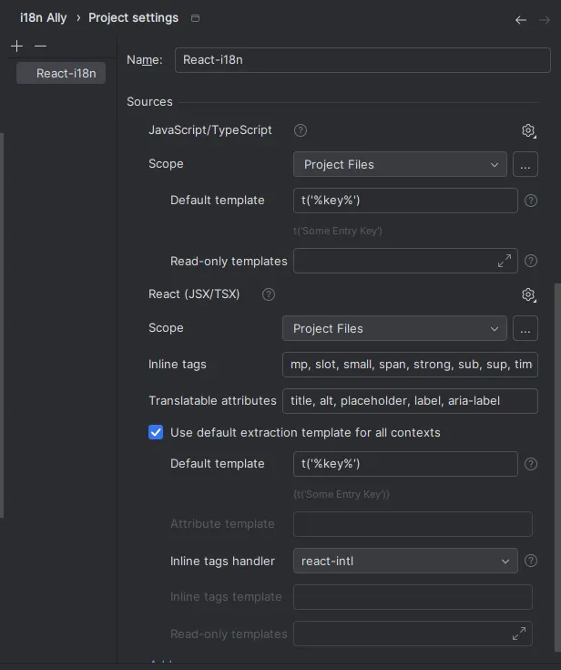
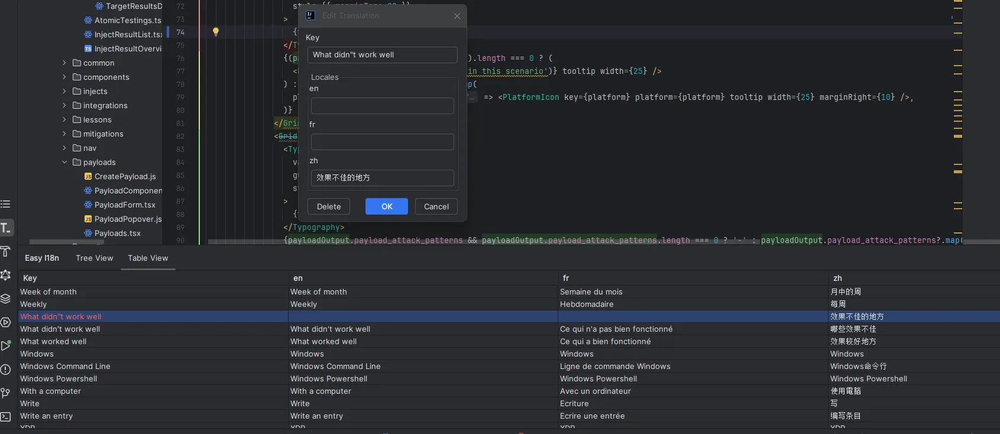

# Adding translations

### Introduction
This guide explains how to add translations when developing with OpenBAS. We have 3 files to support the app’s languages: en.json (the reference file - for english), fr.son (for french) and zh.json (for chinese). We have set up some elements to streamline the translation process.

#### 1. Using scripts
You can find translations management scripts in the package.json file.

- extract-translation : will fetch all the files and add new translations keys in en.json 
- auto-translation:fr : will translate all the elements of the en.json in french and add them in the fr.json
- auto-translation:cn : will translate all the elements of the en.json in chinese and add them in the zh.json
- auto-translation: all : will translate all the elements of the en.json in all the app's supoorted languages and add them in the respective files
- sort-translation : will sort the translation files
You can generate your subscription key on Deepl and it in the configurations of your scripts in the your IDE.

#### 2. Using IntelliJ plugins
- i18n ally : allows to manage the regex, check missing translations and extract keys
  
  

- Easy i18n : allows to add, edit, delete, sort and check translations
  
  