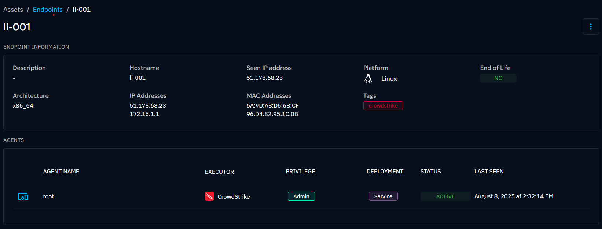

# Assets

The Assets section provides users with a centralized hub for managing and organizing the entities targeted for testing
and simulation.

When you click on “Assets” in the left-hand banner, you see all the “Assets” pages. When accessing the Assets section,
users are directed by default to the Endpoints page, where they can start managing their assets.

From the `Assets` section, users can access the following pages:

- `Endpoints`: Individual entities, representing any object or terminal that can be connected to a network.
- `Asset groups`: Group of asset allowing you to organize endpoints into logical groups based on various filters applied
  by the user.
- `Security platforms`

## Endpoints

Endpoints encompass devices and systems that connect to a network, serving as the foundation for interaction with
OpenBAS.

The list of endpoints continues to grow with the changing landscape of networked technologies and the increasing
interconnectivity of digital ecosystems. Below is a non-exhaustive list of terminal categories:

- **Computers**: This category encompasses a wide range of computing devices, including desktops, laptops, and servers
  deployed within organizational networks.
- **Mobile devices**: Smartphones and tablets represent another prominent category of endpoints, providing users with
  mobile access to network resources and services.
- **Workstations**: Workstations refer to terminals or dedicated machines utilized by individuals or groups to perform
  specific tasks or access networked resources. These systems are typically tailored to meet specific operational
  requirements and may include specialized software or configurations.
- **IoT devices**: The Internet of Things (IoT) encompasses a diverse array of interconnected devices and sensors. IoT
  endpoints include smart thermostats, cameras, environmental sensors, smart watches, and health tracking devices, among
  others.

When accessing the Endpoints pages, you see the list of all endpoints imported in your platform. Here, users can manage 
details specific to each endpoint.

!!! note

    Openbas marks an endpoint as inactive if none of its agents have communicated within one hour.

By clicking on an endpoint, you will be able to access its details :

To register new endpoints, you will need to install an agent. You can find detailed instructions on the [agent installation page](../usage/openbas-agent.md).

!!! note

    The register rule to know for the endpoint/agent create/update is the following:

    - The identifier for an endpoint is its mac addresses (except for Caldera agent, which is the hostname and ip addresses).
    - The identifier for an agent is its own "key" (endpoint, agent name, executor, privilege and deployment).

## Agentless endpoints

In order to provide flexibility in environments where agents cannot be deployed or when working with theoretical scenarios or sensitive systems, 
our platform allows users to manually create endpoints. Since they are manually created, they have the **Agentless** status. 

Users have two ways to create agentless endpoints:

- Use the form : the user clicks on the **+** sign, then a drawer opens with the appropriate form
  
- Import via a csv file : the user clicks on the appropriate icon, then selects a csv file and the endpoints are created

!!! note

    Buttons for import and export of endpoints are available at the top of the list. The csv for the import must have 
    the following columns: name, description, hostname, ips, platform, arch, macAddresses and tags. The exported csv 
    has the same coloumns. Export is a good way to visualize the correct format of the columns for the the import.
    

## Asset groups

Asset groups serve as a mechanism for organizing and grouping related Endpoints. These groups are constructed based on
filters that define the criteria for inclusion, allowing administrators to segment and categorize Endpoints based on
common characteristics or attributes.

When creating a new asset group, administrators have the flexibility to specify the filters that will delineate the
group's membership. Currently, the platform offers a range of filters such as platform type, hostname, and IP addresses.
We plan to extend the possibilities by including additional filters in future updates.

## Security platforms

Some integrations in OpenBAS are connected to your security platforms, such as Microsoft Sentinel, Microsoft Defender,
etc., and can be viewed on this screen.

OpenBAS strives to support as many integrations as possible with the most popular tools on the market. However, if your
security platform integration is not yet available, you can create it manually here.

