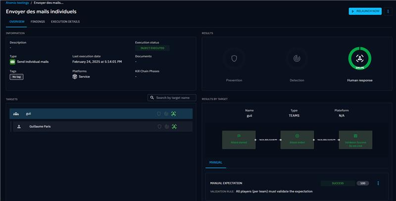
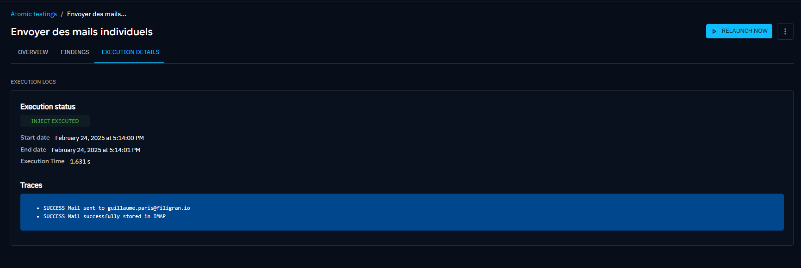
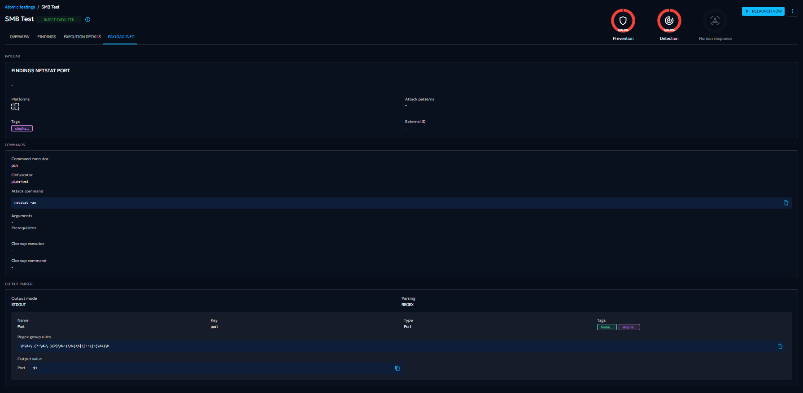

# Atomic testing

When clicking on Atomic testing in the left menu, you access to the list of all atomic testings ever launched in the platform.

Atomic testing is a great way to simulate a singular attack technique you are particulary interested in, and test immediately your capability to prevent and detect it.

The presented list allows you to easily see global scores of all your recent atomic testings.

## Search the list

You can search the list using the name or one the filters. Here are the available filters for this list.

Once you choose the attribute you want to apply a filter on, you can choose the operator.

Then you have the list of values for the attributes you choose.

Here is the list once you apply the filter.

## Create an Atomic testing

An atomic testing is essentially the simulation of a single inject, against a selection of targets (Players, Teams, Assets, Assets Group) with assorted expectations.

By clicking on the + button at the bottom right of the screen, you enter the atomic testing creation workflow.

On the left of the creation screen is the list of all available Inject you can play for atomic testing. Logos on the left of each line indicates which Injector is associated with each inject.

Depending on your integrations, this list can be long. You can filter the list by kill chain phase, injector, compatible platforms or Mitre Att&ck tactics.By clicking on the "Att&CK" logo near the search bar, you can also filter by selecting a precise Mitre Att&ck techniques.

When selecting an inject on the left, the form on the right populates itself with a by-default title and propose you to define when the inject should be played after the launch of the atomic testing. You can keep it to 0.

By clicking on Inject content, you can define now or later the targeted assets or players, needed configurations, and the assorted expectations.

The "available variables" button helps you to use already defined variables into compatible fields.

## Atomic testing screens

Details of an Atomic testing is composed of three parts:
- a header allowing to launch the test, see its state and update/delete it.
- an Overview screen to eaily see the results of the test.
- an execution details screen to see expectations of the test and investigate on execution logs

### Overview

The first screen displayed when you click on a specific Atomic testing from the list is a breakdown of your security posture against this test. 

As for Simulation and Scenario, Results are broken down into:
- Prevention: the ability of your security posture to prevent the inject
- Detection: the ability of your security posture to detect the inject
- Human response: the ability of your security teams to react as intented facing the inject

Big metrics on top of the screen sum up the expectations' result of all targets. 

The list of targets on the left allows you to easily see the result per Target, and for example investigate further why a specific Asset have failed the test.

For a selected target, you can on the right the timeline of the test against the target and the assorted results. The result logs are also displayed.

### Execution details

On this screen, you can retrieve details about the configuration, the command lines (if relevant) and the execution logs of the atomic testing and its expectations.

You can also see the raw execution logs of the [Injector](injectors.md) responsible for the test execution.

For technical injects, you can see the raw execution logs of the agents that executed the test.

### Payload info
This screen is available for technical injects only. You can see the details of the payload related to the test.

