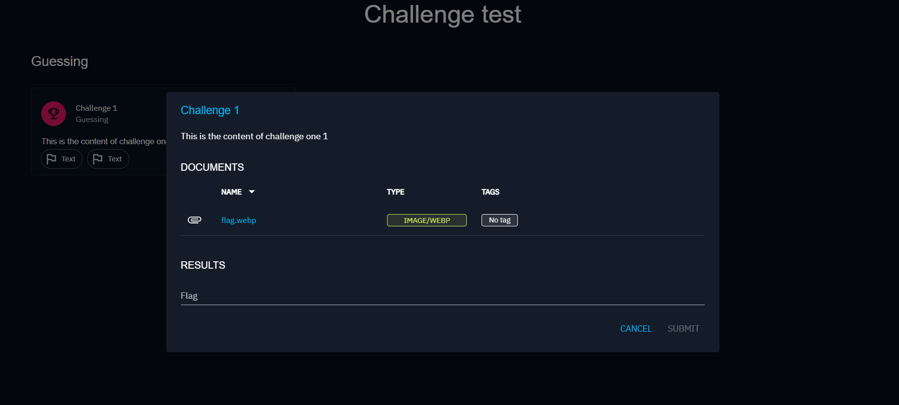

# Challenges

Challenges are integral to handling CTF (Capture The Flag) activities on the OpenBAS platform. You can define your
challenge and the flags that need to be found to complete it.

## Create a Challenge

To create a new challenge, follow these steps:

1. Click the + button at the bottom right corner of the screen.
2. Give your new challenge a name and specify one or more flags.
3. Optionally, fill in additional fields to provide more context to your players, such as the category, content (
   explanation, context, steps), and attach any relevant documents.
4. Manage your challenge by setting a score and a maximum number of attempts allowed for completing the challenge.

Once completed, your new challenge will appear in the challenge list.

## Use a Challenge

Challenges can be utilized in Scenarios and Simulations. When creating an inject of type "Publish challenges," you need
to select a challenge to be sent to your players.

Once the scenario/simulation is triggered, an email is sent to the targeted players with a link.

When clicking on the link the player is redirected to a page with a clickable card. Clicking on the card opens a modal with a textfield, where the player can enter the flag of the challenge.

The initiator of the simulation can check the results. On this picture, a player of the team answered correctly while the others have not answered yet. Note that by default, players have a day to respond.