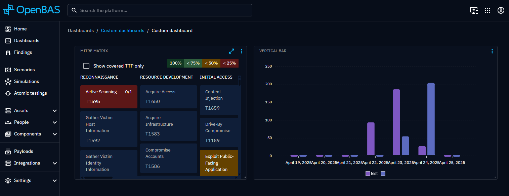

# Custom dashboards

OpenBAS provides an adaptable and entirely customizable dashboard functionality. The flexibility of OpenBAS's dashboard
ensures a tailored and insightful visualization of data, fostering a comprehensive understanding of the platform's
live activity.

## List of custom dashboards

From the left menu, you can choose the custom dashboards option to see all the custom dashboards you have created.

**Actions panel**

You can realise actions on a dashboard using the button located at the end of each line::

- update
- delete

## Dashboard overview

You have the flexibility to tailor the arrangement of [widgets](../widgets/widgets.md) on your dashboard.
Widgets can be intuitively placed to highlight key information. Additionally, you can resize widgets from the bottom
right corner based on the importance of the information, enabling adaptation to specific analytical needs. This
technical flexibility ensures a fluid, visually optimized user experience.

