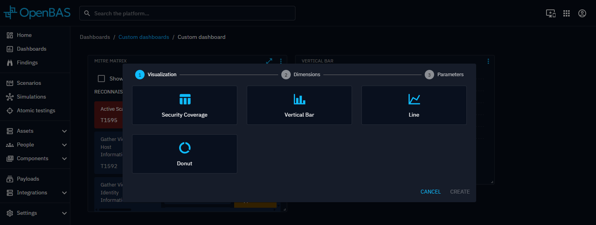
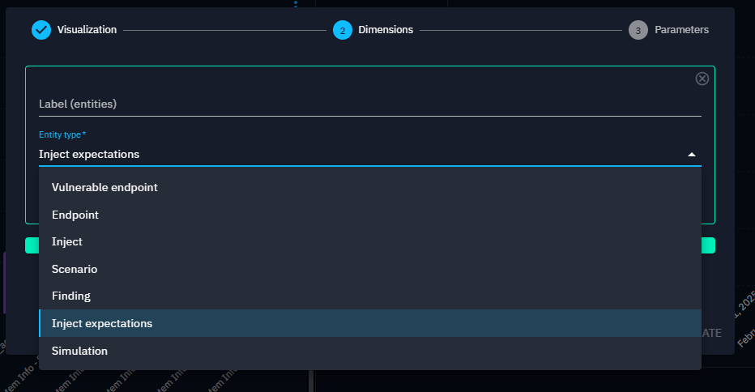

# Widget creation

Creating widgets on the [dashboard](../custom-dashboards/custom-dashboards.md) involves a four-step configuration
process. By navigating through these configuration steps, users can design widgets that meet their specific
requirements.

## Widget configuration

#### 1. Visualization

Start by selecting a visualization type that best represents the data you want to display. The visualization choice
determines which dimensions and parameters are available, so it’s important to pick one that aligns with the insights
you're aiming to uncover.

#### 2. Dimensions

Dimensions are determined by the selected perspective and define the dataset used by the widget. You can also apply
filters to refine the data and focus the analysis on specific subsets.

First, you have to choose the entity that will provide the data for the widget.

You can now, in some cases, choose specific values or dynamic parameters to filter. If you choose a dynamic parameter, the widget will be calculated according to the context of the screen.

#### 3. Parameters

Parameters allow further customization of your widget. Based on the selected visualization, you can:

- Set the widget title
- Choose which elements to display from the filtered dataset
- Select the data reference date
- Select a time range for the datas
- Configure additional settings specific to each visualization type

Two mode are available:

- Structural: projects your data based on a structural property
  

- Temporal: projects your data based on a temporal property
  

The values for the time range are: dashboard time range, all time, custom range, last 24 hours, last 7 days, last month, last 3 months, last 6 
months and last year.

!!! note
 
    The default value **Dashboard time range** for the time range parameter defines the time range of the dashboard as the one for the widget.
