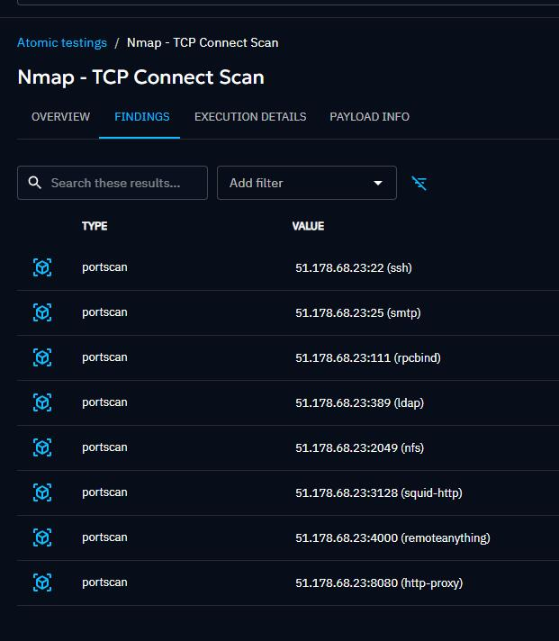

# Findings

Findings provide insights into discovered security weaknesses, misconfigurations, or vulnerabilities that could be exploited.

They are generated from the injector's structured output, which can take multiple forms, including IPv4, Text, IPv6, Port, PortScan (object), and Credentials (object).

Each finding is associated with an [Inject](injects.md) and an [Asset (endpoint)](assets.md).

## Inject

You can find findings in the inject result page (only for an [Atomic testing](atomic.md) at the moment)

