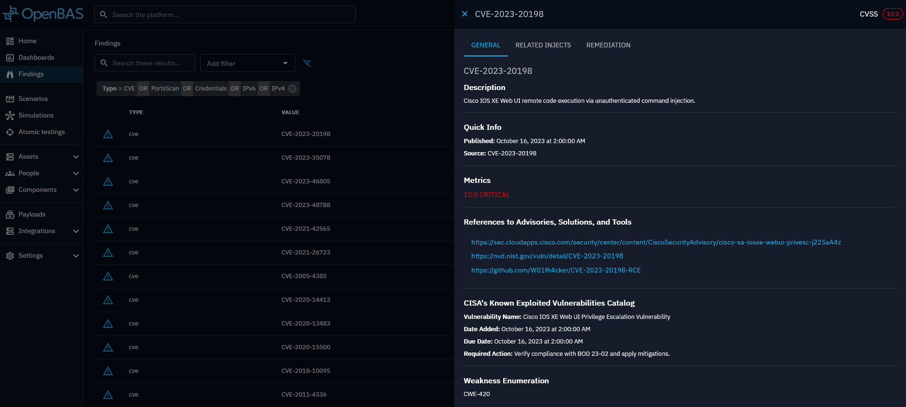
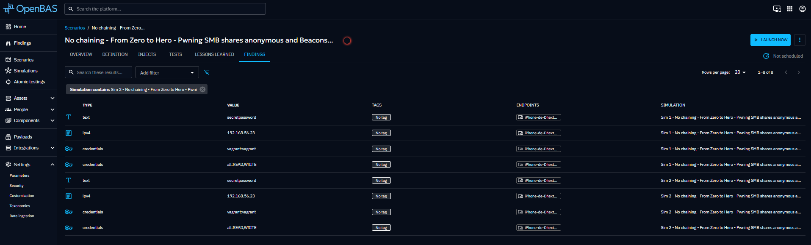
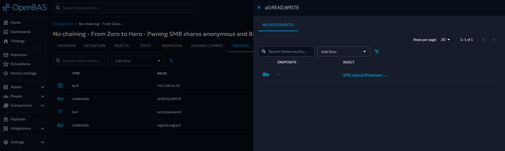

# Findings

Findings provide insights into discovered security weaknesses, misconfigurations, or vulnerabilities that could be
exploited.

They are generated from the injector's structured output, which can take multiple forms, including IPv4, Text, IPv6,
Port, PortScan (object), and Credentials (object).

Each finding is associated with an [Inject](injects.md) and an [Asset (endpoint)](assets.md).

Findings can be accessed at various levels across the platform. In the Findings view, only aggregated values are
initially displayed to provide a high-level overview.

When a specific finding is clicked, a drawer opens to reveal more detailed information. This includes:
* The associated inject(s) where the finding was discovered
* For CVE-type findings, enriched data previously sourced from [taxonomies](../administration/taxonomies.md) is available, such as:
  - General information about the CVE 
  - A Remediation tab with actionable recommendations (EE)

- Global level
  
  
  
  
  
- Scenario level  
  
- Simulation level  
  
- Inject level   
  
- Atomic level
  
- Endpoint level   
   

