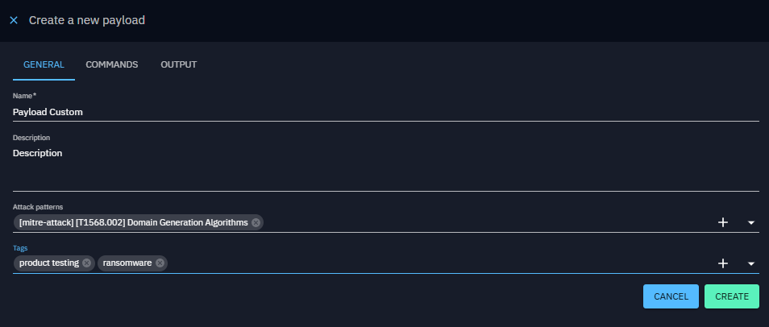
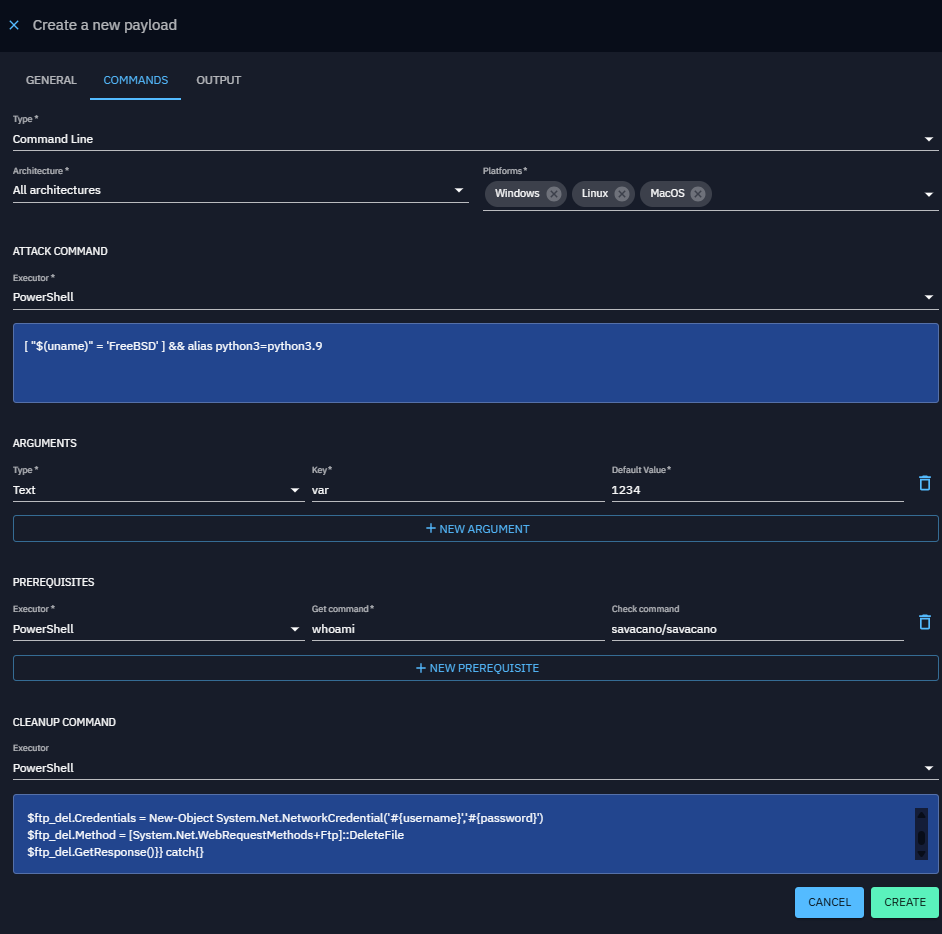
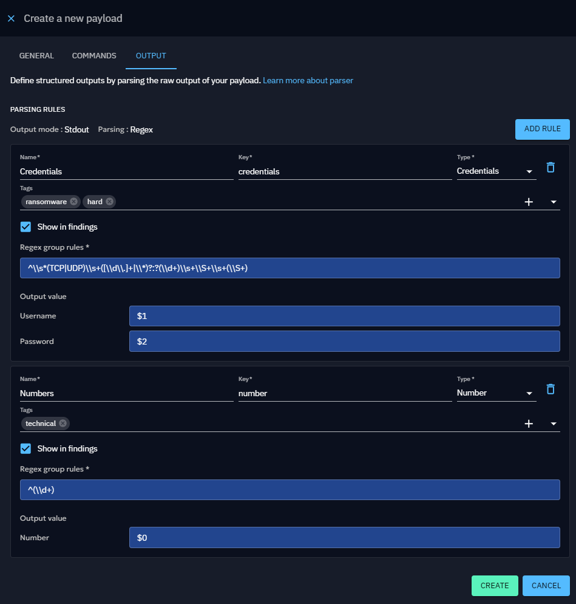
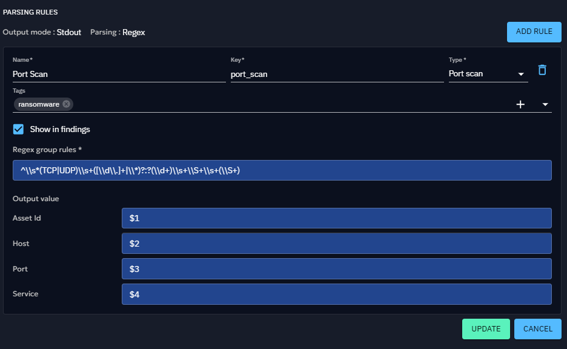

# Payloads

In OpenBAS, you can create custom payloads based on different types to create new injects.

Payloads enhance the platform, allowing you to further customize your scenarios.

## Create a Payload

To create a new payload, follow these steps:

1. Click the **"+" button** in the bottom right corner of the screen.
2. In the **General Information** tab, fill in the required details about the payload.
3. In the **Commands** tab:

   3.1 Choose a **payload type** based on your needs:
    - **Command Line**: Executes a command using an executor (e.g., PowerShell, Bash, etc.).
    - **Executable**: Runs an executable file on an asset.
    - **File Drop**: Drops a file onto an asset.
    - **DNS Resolution**: Resolves a hostname into IP addresses.

   3.2 Provide **additional execution details**, such as arguments and prerequisites.  
   3.3 Specify a **cleanup executor and cleanup command** to remove any remnants from execution on the asset.

4. In the **Output Parsers** tab (optional):

   4.1 Add **[Output Parsers](#output-parsers)** to process the raw output of your execution.  
   4.2 Specify whether to generate **[Findings](../findings.md)** from the output.

Once completed, your new payload will appear in the payload list.

### General Payload properties

| Property        | Description                     |
|-----------------|---------------------------------|
| Name            | Payload name                    |
| Description     | Payload description             |
| Attack patterns | Command-related attack patterns |
| Tags            | Tags                            |

#### Prerequisites in depth

| Property         | Description                                                         |
|------------------|---------------------------------------------------------------------|
| Platforms        | Compatible platforms (ex. Windows, Linux, MacOS)                    | 
| Arguments        | Arguments for the cleanup, prerequisites and potential command line |                                                                                                                                                                                                                                         |
| Prerequisites    | Prerequisites required to execute the command                       |                                                                                                                                                                                                                      |
| Cleanup executor | Executor for cleaning commands                                      |                                     |
| Cleanup command  | Cleanup command to remove or reset changes made                     |                    

### Additional Payload properties by type

#### Command Line

This payload type executes commands directly on the command line interface (CLI) of the target system
(e.g., Windows Command Prompt, PowerShell, Linux Shell).

Command Line payloads are used for remote command execution to simulate common attacker actions like privilege
escalation or data exfiltration.

| Property         | Description                                                                          |
|------------------|--------------------------------------------------------------------------------------|
| Architecture     | Architecture in which the command can be executed (x86_64, arm64, all architectures) |
| Command executor | Executor for command to execute                                                      |
| Command          | Command to execute                                                                   |

#### Executable

An Executable payload involves delivering a binary file (such as .exe on Windows or ELF on Linux) that the system runs
as an independent process.

Executables can perform a variety of functions, from establishing a backdoor to running complex scripts (mimic malware).

| Property        | Description                                                           |
|-----------------|-----------------------------------------------------------------------|
| Architecture    | Architecture in which the command can be executed (ex. x86_64, arm64) |
| Executable file | File to execute                                                       |

#### File Drop

File Drop payloads are designed to deliver files (e.g., scripts, documents, binaries) to the target system without
immediately executing them.

The goal is typically to simulate scenarios where attackers place files in specific locations for later use, either
manually or by another process.

| Property     | Description  |
|--------------|--------------|
| File to drop | File to drop |

#### DNS Resolution

DNS resolution payloads attempts to resolve hostnames to associated IP address(es).

The goal of DNS resolution is to test if specific hostnames resolve to IP addresses correctly, helping assess network
accessibility, detect issues, and simulate potential attacker behavior.

| Property  | Description              |
|-----------|--------------------------|
| Hostnames | Hostname list to resolve |

### Output Parsers

Output Parsers allows processing the raw output from an execution. You can define rules to extract specific data from
the output and link it to variables.

These variables can then be used for [chaining injects](../injects.md/#conditional-execution-of-injects).

Currently, Output Parsers support:

* Output Mode: **StdOut**
* Parsing Type: **REGEX**

If the extracted data is compatible with a [Finding](../findings.md), you can enable **"Show in Findings"**
option. They will then appear in the Findings tab of the Atomic Testing Detail View.

#### Defining a Rule

When adding a rule, the following properties must be defined:

| Property     | Description                                                                                                                                                                                                                                                       | Mandatory |
|--------------|-------------------------------------------------------------------------------------------------------------------------------------------------------------------------------------------------------------------------------------------------------------------|-----------|
| Name         | The name of the rule.                                                                                                                                                                                                                                             | Yes       |
| Key          | A unique key identifier.                                                                                                                                                                                                                                          | Yes       |
| Type         | The data type being extracted (e.g., Text, Number, Port, IPv4, IPv6, Port Scan, Credentials).                                                                                                                                                                     | Yes       |
| Tags         |                                                                                                                                                                                                                                                                   | No        |
| Regex        | A regular expression (REGEX) to extract data from the raw output. Supports capturing groups and line anchors (e.g., ^ for start of line). Currently, We use these flags by default: Pattern.MULTILINE, Pattern.CASE_INSENSITIVE, Pattern.UNICODE_CHARACTER_CLASS. | Yes       |
| Output Value | Map each regex capture group to the corresponding fields based on the selected type.                                                                                                                                                                              | Yes       |

### Output Value Mapping

Depending on the Type, a specific number of fields can be extracted using the group index from the regex :

| Type        | Fields                       |
|-------------|------------------------------|
| Port Scan   | assetId, host, port, service |
| Credentials | username, password           |
| Other       | single extracted value       |

The group index must start with **$** to differentiate between multiple capture groups.

### Payload execution workflow

## Use a Payload

After creation, a new inject type will automatically appear in the inject types list if the implant you're using
supports it (the OpenBAS Implant does).

